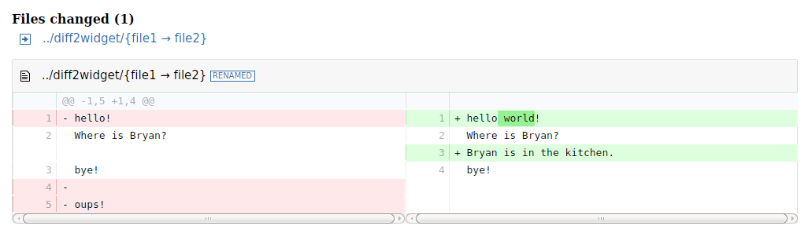

# diffRgit

Create an HTML git diff widget using the diff2html library.

[](https://codepen.io/salc2/pen/gwdxrB)


### Installation

Install the dependencies:

```sh
> require(devtools)
> install_github("abossi/diffRgit")
```

### exemple

```sh
> diff <- "diff --git a/../diff2widget/file1 b/../diff2widget/file2\nindex ab63d51..eb01961 100644\n--- a/../diff2widget/file1\n+++ b/../diff2widget/file2\n@@ -1,5 +1,4 @@\n-hello!\n+hello world!\n Where is Bryan?\n+Bryan is in the kitchen.\n bye!\n-\n-oups!"

> diffRgit(diff)
```

result:


